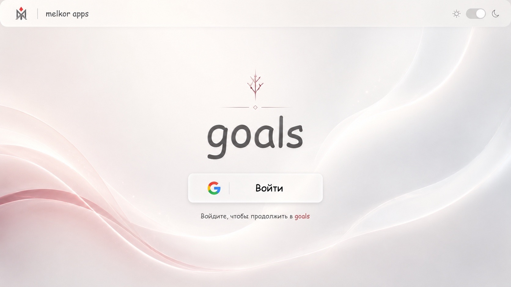

# 1. Авторизация и экран входа

<i>Прототип</i>

## 1.1 Цель

Пользователь должен иметь возможность открыть `goals-front`, увидеть фирменный экран входа приложения и перейти в авторизацию через Google.

## 1.2 Scope текущего этапа

В текущем этапе реализуется только экран входа и само приложение целей внутри репозитория фронтенда.

Функциональность разводящей страницы `Melkor Apps` фиксируется в документации как будущий этап, но пока не разрабатывается.

## 1.3 Пользовательский сценарий входа

1. Неавторизованный пользователь открывает приложение.
2. Пользователь видит экран авторизации с тем же визуальным языком, который позже будет использован на разводящей странице.
3. В центре по вертикали и горизонтали отображается название приложения, например `goals`.
4. Под названием отображается единственная кнопка `Войти`.
5. При нажатии на кнопку пользователь перенаправляется в Google OAuth через auth-сервис.
6. После успешной авторизации пользователь возвращается в приложение целей.

## 1.4 Требования к экрану входа

- Фон экрана должен быть анимированным: градиент или иной мягкий эффект с переливами цветов.
- Визуальный стиль должен быть спокойным, чистым и атмосферным.
- `Primary` и `secondary` цвета темы должны ассоциироваться со вселенной Толкина и образом Melkor:
  спокойные серебристые оттенки с умеренным красноватым акцентом, как образ до и после падения.
- Экран входа должен использовать единую MUI-тему приложения.
- Общие компоненты на этом этапе не выносятся из репозитория.

## 1.5 Верхняя функциональная панель

Сверху приложения должна находиться функциональная панель.

На панели:

- в правом верхнем углу располагается переключатель темы;
- выбранная тема должна применяться во всех экранах текущего приложения;
- правее переключателя отображается профиль пользователя;
- если пользователь авторизован, в профиле показываются первые буквы ФИО;
- если пользователь не авторизован, вместо профиля показывается иконка анонимного пользователя.

## 1.6 Отложенные требования для будущей разводящей страницы Melkor Apps

Требования ниже документируются сейчас, но не входят в текущую реализацию.

- Есть точка входа в виде разводящей landing-page с крупной надписью `Melkor Apps` по центру экрана.
- Под надписью отображается список приложений: максимум три карточки в ряд.
- Каждый элемент списка состоит только из иконки и названия приложения, без рамок и фоновых плашек.
- При загрузке страницы заголовок `Melkor Apps` сначала плавно проявляется и анимированно смещается вверх.
- После этого приложения под заголовком появляются по одному через fade-анимацию.
- Фон страницы использует ту же анимированную атмосферную подложку, что и экран входа.
- При клике на иконку и название приложения выполняется переход в выбранное приложение.
